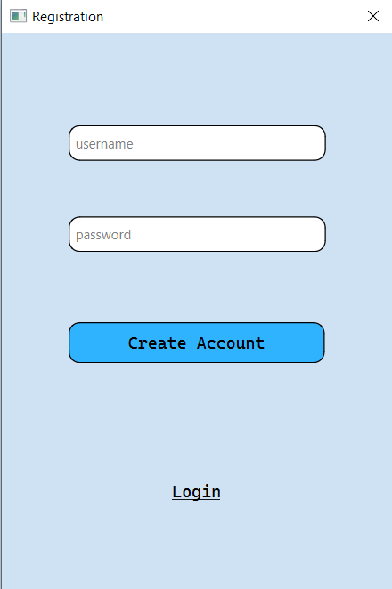
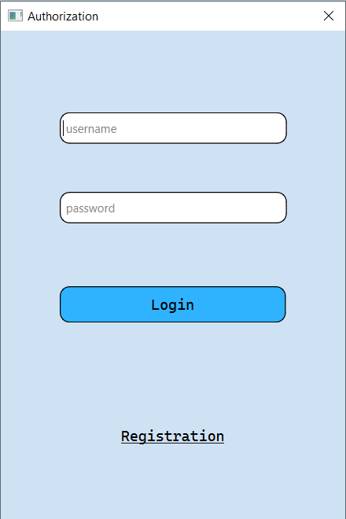

# Setup

GPT setup for Windows:
1. Install CMake and MSBuild
2. Install a release (not debug) version of libtorch to include/cpp_gpt
3. If you installed GPU version of libtorch, install the corresponding CUDA version on your computer and cuDNN library
4. Add to PATH C:\Program Files (x86)\Microsoft Visual Studio\2019\BuildTools\VC\Tools\MSVC\<VERSION>\bin\Hostx86\x64, C:\Program Files (x86)\Microsoft Visual Studio\2019\BuildTools\MSBuild\Current\Bin, C:\Program Files\NVIDIA GPU Computing Toolkit\CUDA\<VERSION>\bin, C:\Program Files\NVIDIA\CUDNN\<VERSION>\bin
5. In case of "CMake error: No CUDA toolset found", copy everything from: C:\Program Files\NVIDIA GPU Computing Toolkit\CUDA\<VERSION>\extras\visual_studio_integration\MSBuildExtensions to: C:\Program Files (x86)\Microsoft Visual Studio\2019\BuildTools\MSBuild\Microsoft\VC\v160\BuildCustomizations
6. In case of "CMake error: Failed to find nvToolsExt", use this: https://discuss.pytorch.org/t/failed-to-find-nvtoolsext/179635/4
7. Install https://github.com/nlohmann/json/releases/download/v3.10.5/json.hpp to include/cpp_gpt/json

# Documentation

## Main window

1. **Top Bar:**
   - Contains three buttons:
     - **Login:** Located at the top-left.
     - **Register:** Positioned next to the Login button.
     - **Logout:** Positioned to the right of the Register button.

2. **Left Panel:**
   - Titled "Dialogs" and has a vertical layout.
   - **Chat 1:** A button representing the current chat, located at the top-left within the panel. It has a red delete icon (X) next to it, which allows the user to delete or close this chat.
   - **+ New Chat +** A button located below the current chat, allowing the user to start a new chat.

3. **Main Chat Area:**
   - Located on the right side of the window, this is where the conversation takes place.
   - The conversation is shown in a white text box area with alternating lines for the user ("You") and the AI.
   - An example conversation is shown:
     - You: Hello
     - AI: Hi

4. **Text Input Field:**
   - Positioned at the bottom of the main chat area.
   - Includes a white text box for typing messages.
   - There is a send button with an arrow (---->) to the right of the text box.

## registration window

**Input Fields:**
   - **Username:** A text input field labeled "username," where the user can type their desired username.
   - **Password:** A text input field labeled "password," where the user can type their desired password.

**Buttons:**
   - **Create Account:** A large blue button labeled "Create Account." This button is for submitting the registration information to create a new account.
   - **Login:** Below the Create Account button, there is a "Login" text link, likely to navigate back to the login window if the user already has an account.

## authorization window

**Input Fields:**
   - **Username:** A text input field labeled "username," where the user can type their username.
   - **Password:** A text input field labeled "password," where the user can type their password.

**Buttons:**
   - **Login:** A large blue button labeled "Login." This button is for submitting the login information to access the account.
   - **Registration:** Below the Login button, there is a "Registration" text link, likely to navigate to the registration window if the user does not have an account.
